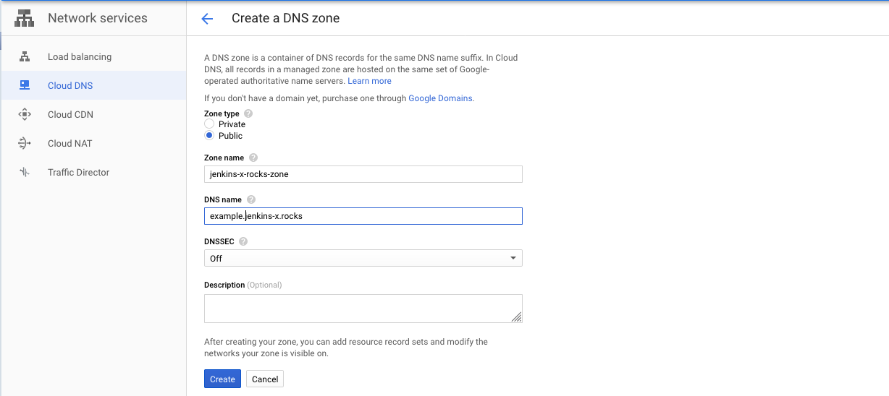
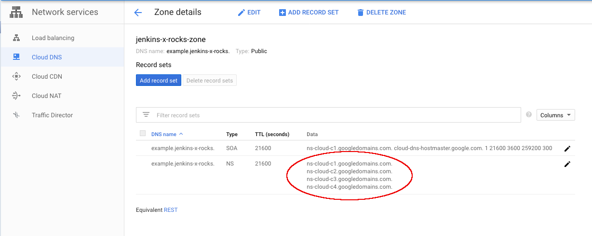

# Jenkins X GKE Module


__NOTE:__ While the required minimum Terraform version is 0.12.0, automated CI tests are performed with 0.13 only.  The only expected
compatibility issues to be aware of are around provider requirements.  For more information see [here](https://www.terraform.io/docs/configuration/provider-requirements.html#v0-12-compatible-provider-requirements)

---

This repo contains a [Terraform](https://www.terraform.io/) module for provisioning a Kubernetes cluster for [Jenkins X](https://jenkins-x.io/) on [Google Cloud](https://cloud.google.com/).

<!-- TOC -->

- [Jenkins X GKE Module](#jenkins-x-gke-module)
  - [What is a Terraform module](#what-is-a-terraform-module)
  - [How do you use this module](#how-do-you-use-this-module)
    - [Prerequisites](#prerequisites)
    - [Cluster provisioning](#cluster-provisioning)
      - [Inputs](#inputs)
      - [Outputs](#outputs)
    - [Running `jx boot`](#running-jx-boot)
    - [Using a custom domain](#using-a-custom-domain)
    - [Production cluster considerations](#production-cluster-considerations)
  - [FAQ](#faq)
    - [How do I get the latest version of the terraform-google-jx module](#how-do-i-get-the-latest-version-of-the-terraform-google-jx-module)
    - [How to I specify a specific google provider version](#how-to-i-specify-a-specific-google-provider-version)
    - [Why do I need Application Default Credentials](#why-do-i-need-application-default-credentials)
  - [Development](#development)
    - [Releasing](#releasing)
  - [How do I contribute](#how-do-i-contribute)

<!-- /TOC -->

## What is a Terraform module

A Terraform "module" refers to a self-contained package of Terraform configurations that are managed as a group.
For more information around modules refer to the Terraform [documentation](https://www.terraform.io/docs/modules/index.html).

## How do you use this module

### Prerequisites

To make use of this module, you need a Google Cloud project.
Instructions on how to setup such a project can be found in the  [Google Cloud Installation and Setup](https://cloud.google.com/deployment-manager/docs/step-by-step-guide/installation-and-setup) guide.
You need your Google Cloud project id as an input variable for using this module.

You also need to install the Cloud SDK, in particular `gcloud`.
You find instructions on how to install and authenticate in the [Google Cloud Installation and Setup](https://cloud.google.com/deployment-manager/docs/step-by-step-guide/installation-and-setup) guide as well.

Once you have `gcloud` installed, you need to create [Application Default Credentials](https://cloud.google.com/sdk/gcloud/reference/auth/application-default/login) by running:

```bash
gcloud auth application-default login
```

Alternatively, you can export the environment variable _GOOGLE_APPLICATION_CREDENTIALS_ referencing the path to a Google Cloud [service account key file](https://cloud.google.com/iam/docs/creating-managing-service-account-keys).

Last but not least, ensure you have the following binaries installed:

- `gcloud`
- `kubectl` ~> 1.14.0
    - `kubectl` comes bundled with the Cloud SDK
- `terraform` ~> 0.12.0
    - Terraform installation instruction can be found [here](https://learn.hashicorp.com/terraform/getting-started/install)

### Cluster provisioning

A default Jenkins X ready cluster can be provisioned by creating a file _main.tf_ in an empty directory with the following content:

```terraform
module "jx" {
  source  = "jenkins-x/jx/google"

  gcp_project = "<my-gcp-project-id>"
}

output "jx_requirements" {
  value = module.jx.jx_requirements
}  
```

You can then apply this Terraform configuration via:

```bash
terraform init
terraform apply
```

This creates a cluster within the specified Google Cloud project with all possible configuration options defaulted.

:warning: **Note**: This example is for getting up and running quickly.
It is not intended for a production cluster.
Refer to [Production cluster considerations](#production-cluster-considerations) for things to consider when creating a production cluster.

On completion of `terraform apply` a _jx\_requirements_ output is available which can be used as input to `jx boot`.
Refer to [Running `jx boot`](#running-jx-boot) for more information.

In the default configuration, no custom domain is used.
DNS resolution occurs via [nip.io](https://nip.io/).
For more information on how to configure and use a custom domain, refer to [Using a custom domain](#using-a-custom-domain).

If you just want to experiment with Jenkins X, you can set `force_destroy` to `true`.
This allows you to remove all generated resources when running `terraform destroy`, including any generated buckets including their content.

The following two paragraphs provide the full list of configuration and output variables of this Terraform module.

#### Inputs

| Name | Description | Type | Default | Required |
|------|-------------|------|---------|:--------:|
| apex\_domain | The parent / apex domain to be used for the cluster | `string` | `""` | no |
| apex\_domain\_gcp\_project | The GCP project the apex domain is managed by, used to write recordsets for a subdomain if set.  Defaults to current project. | `string` | `""` | no |
| apex\_domain\_integration\_enabled | Flag that when set attempts to create delegation records in apex domain to point to domain created by this module | `bool` | `true` | no |
| bucket\_location | Bucket location for storage | `string` | `"US"` | no |
| cluster\_location | The location (region or zone) in which the cluster master will be created. If you specify a zone (such as us-central1-a), the cluster will be a zonal cluster with a single cluster master. If you specify a region (such as us-west1), the cluster will be a regional cluster with multiple masters spread across zones in the region | `string` | `"us-central1-a"` | no |
| cluster\_name | Name of the Kubernetes cluster to create | `string` | `""` | no |
| cluster\_network | The name of the network (VPC) to which the cluster is connected | `string` | `"default"` | no |
| cluster\_subnetwork | The name of the subnetwork to which the cluster is connected. Leave blank when using the 'default' vpc to generate a subnet for your cluster | `string` | `""` | no |
| create\_ui\_sa | Whether the service accounts for the UI should be created | `bool` | `true` | no |
| dev\_env\_approvers | List of git users allowed to approve pull request for dev enviornment repository | `list(string)` | `[]` | no |
| enable\_backup | Whether or not Velero backups should be enabled | `bool` | `false` | no |
| enable\_private\_endpoint | (Beta) Whether the master's internal IP address is used as the cluster endpoint. Requires VPC-native | `bool` | `false` | no |
| enable\_private\_nodes | (Beta) Whether nodes have internal IP addresses only. Requires VPC-native | `bool` | `false` | no |
| force\_destroy | Flag to determine whether storage buckets get forcefully destroyed | `bool` | `false` | no |
| gcp\_project | The name of the GCP project to use | `string` | n/a | yes |
| git\_owner\_requirement\_repos | The git id of the owner for the requirement repositories | `string` | `""` | no |
| gsm | Enables Google Secrets Manager, not available with JX2 | `bool` | `false` | no |
| ip\_range\_pods | The IP range in CIDR notation to use for pods. Set to /netmask (e.g. /18) to have a range chosen with a specific netmask. Enables VPC-native | `string` | `""` | no |
| ip\_range\_services | The IP range in CIDR notation use for services. Set to /netmask (e.g. /21) to have a range chosen with a specific netmask. Enables VPC-native | `string` | `""` | no |
| jenkins\_x\_namespace | Kubernetes namespace to install Jenkins X in | `string` | `"jx"` | no |
| jx2 | Is a Jenkins X 2 install | `bool` | `true` | no |
| jx\_bot\_token | Bot token used to interact with the Jenkins X cluster git repository | `string` | `""` | no |
| jx\_bot\_username | Bot username used to interact with the Jenkins X cluster git repository | `string` | `""` | no |
| jx\_git\_operator\_version | The jx-git-operator helm chart version | `string` | `"0.0.192"` | no |
| jx\_git\_url | URL for the Jenins X cluster git repository | `string` | `""` | no |
| kuberhealthy | Enables Kuberhealthy helm installation | `bool` | `true` | no |
| lets\_encrypt\_production | Flag to determine wether or not to use the Let's Encrypt production server. | `bool` | `true` | no |
| master\_authorized\_networks | List of master authorized networks. If none are provided, disallow external access (except the cluster node IPs, which GKE automatically allowlists). | `list(object({ cidr_block = string, display_name = string }))` | `[]` | no |
| master\_ipv4\_cidr\_block | The IP range in CIDR notation to use for the hosted master network.  This range must not overlap with any other ranges in use within the cluster's network, and it must be a /28 subnet | `string` | `"10.0.0.0/28"` | no |
| max\_node\_count | Maximum number of cluster nodes | `number` | `5` | no |
| max\_pods\_per\_node | Max gke nodes = 2^($CIDR\_RANGE\_PER\_NODE-$POD\_NETWORK\_CIDR) (see [gke docs](https://cloud.google.com/kubernetes-engine/docs/how-to/flexible-pod-cidr)) | `number` | `64` | no |
| min\_node\_count | Minimum number of cluster nodes | `number` | `3` | no |
| node\_disk\_size | Node disk size in GB | `string` | `"100"` | no |
| node\_disk\_type | Node disk type, either pd-standard or pd-ssd | `string` | `"pd-standard"` | no |
| node\_machine\_type | Node type for the Kubernetes cluster | `string` | `"n1-standard-2"` | no |
| node\_preemptible | Use preemptible nodes | `bool` | `false` | no |
| node\_spot | Use spot nodes | `bool` | `false` | no |
| parent\_domain | \*\*Deprecated\*\* Please use apex\_domain variable instead.r | `string` | `""` | no |
| parent\_domain\_gcp\_project | \*\*Deprecated\*\* Please use apex\_domain\_gcp\_project variable instead. | `string` | `""` | no |
| release\_channel | The GKE release channel to subscribe to.  See https://cloud.google.com/kubernetes-engine/docs/concepts/release-channels | `string` | `"REGULAR"` | no |
| resource\_labels | Set of labels to be applied to the cluster | `map(any)` | `{}` | no |
| subdomain | Optional sub domain for the installation | `string` | `""` | no |
| tls\_email | Email used by Let's Encrypt. Required for TLS when apex\_domain is specified | `string` | `""` | no |
| vault\_url | URL to an external Vault instance in case Jenkins X shall not create its own system Vault | `string` | `""` | no |
| velero\_namespace | Kubernetes namespace for Velero | `string` | `"velero"` | no |
| velero\_schedule | The Velero backup schedule in cron notation to be set in the Velero Schedule CRD (see [default-backup.yaml](https://github.com/jenkins-x/jenkins-x-boot-config/blob/master/systems/velero-backups/templates/default-backup.yaml)) | `string` | `"0 * * * *"` | no |
| velero\_ttl | The the lifetime of a velero backup to be set in the Velero Schedule CRD (see [default-backup.yaml](https://github.com/jenkins-x/jenkins-x-boot-config/blob/master/systems/velero-backups/templates/default-backup)) | `string` | `"720h0m0s"` | no |
| version\_stream\_ref | The git ref for version stream to use when booting Jenkins X. See https://jenkins-x.io/docs/concepts/version-stream/ | `string` | `"master"` | no |
| version\_stream\_url | The URL for the version stream to use when booting Jenkins X. See https://jenkins-x.io/docs/concepts/version-stream/ | `string` | `"https://github.com/jenkins-x/jenkins-x-versions.git"` | no |
| webhook | Jenkins X webhook handler for git provider | `string` | `"lighthouse"` | no |
| zone | Zone in which to create the cluster (deprecated, use cluster\_location instead) | `string` | `""` | no |

#### Outputs

| Name | Description |
|------|-------------|
| backup\_bucket\_url | The URL to the bucket for backup storage |
| cluster\_location | The location of the created Kubernetes cluster |
| cluster\_name | The name of the created Kubernetes cluster |
| connect | The cluster connection string to use once Terraform apply finishes |
| externaldns\_dns\_name | ExternalDNS name |
| externaldns\_ns | ExternalDNS nameservers |
| gcp\_project | The GCP project in which the resources got created |
| jx\_requirements | The jx-requirements rendered output |
| log\_storage\_url | The URL to the bucket for log storage |
| report\_storage\_url | The URL to the bucket for report storage |
| repository\_storage\_url | The URL to the bucket for artifact storage |
| tekton\_sa\_email | The Tekton service account email address, useful to provide further IAM bindings |
| tekton\_sa\_name | The Tekton service account name, useful to provide further IAM bindings |
| vault\_bucket\_url | The URL to the bucket for secret storage |

### Running `jx boot`

A terraform output (_jx\_requirements_) is available after applying this Terraform module.

```sh
terraform output jx_requirements
```

This `jx_requirements` output can be used as input to [Jenkins X Boot](https://jenkins-x.io/docs/getting-started/setup/boot/) which is responsible for installing all the required Jenkins X components into the cluster created by this module.


:warning: **Note**: The generated _jx-requirements_ is only used for the first run of `jx boot`.
During this first run of `jx boot` a git repository containing the source code for Jenkins X Boot is created.
This (_new_) repository contains a _jx-requirements.yml_ (_which is now ahead of the jx-requirements output from terraform_) used by successive runs of `jx boot`.

Execute:

```sh
terraform output jx_requirements > <some_empty_dir>/jx-requirements.yml
# jenkins-x creates the environment repository directory localy before pushing to the Git server of choice
cd <some_empty_dir>
jx boot --requirements jx-requirements.yml
```

You are prompted for any further required configuration.
The number of prompts depends on how much you have [pre-configured](#inputs) via your Terraform variables.

### Using a custom domain

If you want to use a custom domain with your Jenkins X installation, you need to provide values for the [variables](#inputs) _apex\_domain_ and _tls\_email_.
_apex\_domain_ is the fully qualified domain name you want to use and _tls\_email_ is the email address you want to use for issuing Let's Encrypt TLS certificates.

Before you apply the Terraform configuration, you also need to create a [Cloud DNS managed zone](https://cloud.google.com/dns/zones), with the DNS name in the managed zone matching your custom domain name, for example in the case of _example.jenkins-x.rocks_ as domain:



When creating the managed zone, a set of DNS servers get created which you need to specify in the DNS settings of your DNS registrar.



It is essential that before you run `jx boot`, your DNS servers settings are propagated, and your domain resolves.
You can use [DNS checker](https://dnschecker.org/) to check whether your domain settings have propagated.

When a custom domain is provided, Jenkins X uses [ExternalDNS](https://github.com/kubernetes-sigs/external-dns) together with [cert-manager](https://github.com/jetstack/cert-manager) to create A record entries in your managed zone for the various exposed applications.

If _apex_domain_ id not set, your cluster will use [nip.io](https://nip.io/) in order to create publicly resolvable URLs of the form ht<span>tp://\<app-name\>-\<environment-name\>.\<cluster-ip\>.nip.io.

### Production cluster considerations

The configuration as seen in [Cluster provisioning](#cluster-provisioning) is not suited for creating and maintaining a production Jenkins X cluster.
The following is a list of considerations for a production usecase.

- Specify the version attribute of the module, for example:

    ```terraform
    module "jx" {
      source  = "jenkins-x/jx/google"
      version = "1.2.4"
      # insert your configuration
    }

   output "jx_requirements" {
     value = module.jx.jx_requirements
   }
   ```

  Specifying the version ensures that you are using a fixed version and that version upgrades cannot occur unintented.

- Keep the Terraform configuration under version control,  by creating a dedicated repository for your cluster configuration or by adding it to an already existing infrastructure repository.

- Setup a Terraform backend to securely store and share the state of your cluster. For more information refer to [Configuring a Terraform backend](#configuring-a-terraform-backend).

### Configuring a Terraform backend

A "[backend](https://www.terraform.io/docs/backends/index.html)" in Terraform determines how state is loaded and how an operation such as _apply_ is executed.
By default, Terraform uses the _local_ backend which keeps the state of the created resources on the local file system.
This is problematic since sensitive information will be stored on disk and it is not possible to share state across a team.
When working with Google Cloud a good choice for your Terraform backend is the [_gcs_ backend](https://www.terraform.io/docs/backends/types/gcs.html)  which stores the Terraform state in a Google Cloud Storage bucket.
The [examples](./examples) directory of this repository contains configuration examples for using the gcs backed with and without optionally configured customer supplied encryption key.

To use the gcs backend you will need to create the bucket upfront.
You can use `gsutil` to create the bucket:

```sh
gsutil mb gs://<my-bucket-name>/
```

It is also recommended to enable versioning on the bucket as an additional safety net in case of state corruption.

```sh
gsutil versioning set on gs://<my-bucket-name>
```

You can verify whether a bucket has versioning enabled via:

```sh
gsutil versioning get gs://<my-bucket-name>
```

## FAQ

### How do I get the latest version of the terraform-google-jx module

```sh
terraform init -upgrade
```

### How to I specify a specific google provider version

```yaml
provider "google" {
  version = "~> 2.12.0"
  project = var.gcp_project
}

provider "google-beta" {
  version = "~> 2.12.0"
  project = var.gcp_project
}
```

### Why do I need Application Default Credentials

The recommended way to authenticate to the Google Cloud API is by using a [service account](https://cloud.google.com/docs/authentication/getting-started).
This allows for authentication regardless of where your code runs.
This Terraform module expects authentication via a service account key.
You can either specify the path to this key directly using the _GOOGLE_APPLICATION_CREDENTIALS_ environment variable or you can run `gcloud auth application-default login`.
In the latter case `gcloud` obtains user access credentials via a web flow and puts them in the well-known location for Application Default Credentials (ADC), usually _~/.config/gcloud/application_default_credentials.json_.

## Development

### Releasing

At the moment there is no release pipeline defined in [jenkins-x.yml](./jenkins-x.yml).
A Terraform release does not require building an artifact, only a tag needs to be created and pushed.
To make this task easier and there is a helper script `release.sh` which simplifies this process and creates the changelog as well:

```sh
./scripts/release.sh
```

This can be executed on demand whenever a release is required.
For the script to work the envrionment variable _$GH_TOKEN_ must be exported and reference a valid GitHub API token.

## How do I contribute

Contributions are very welcome! Check out the [Contribution Guidelines](./CONTRIBUTING.md) for instructions.
